 

## 👋 About Me

Hello!! I've been trying to learning by building real open source projects around animals, conservation, research friendly data, and practical field workflows.

I love projects where the software needs help in dealing with messy information, uncertainty, and real constraints that may lack in wherever field it's located in. **(& Hopefully i would've learned cloud, devOps, linux, git/gitHub, py, ts, desktop dev, and computer vision by the time i'm done!)**.

> I'm still learning, so these projects are not presented as professional veterinary, clinical, emergency response, or research services. I build them openly, test them hard, document what breaks, and keep improving them with proper testing. I'm always available for contact!

## 🌿 Featured Projects

<table>
<tr>
<td width="50%" valign="top">

### 🌲 Wildlife Incident Handoff

**Clear information. Safer handoffs.**

A local-first, privacy-conscious desktop tool for recording wildlife incidents and preserving context as information moves between reporters, responders, transporters, rehabilitation organizations, and other wildlife professionals.

**Current focus:** external tester releases, privacy, maps, handoffs, local workflows, and safe updates.

</td>
<td width="50%" valign="top">

### 🐈 OpenFHS

An open-source project for structured feline-health observations and research-ready data, with emphasis on uncertainty, provenance, missingness, privacy, and portability.

It began around Feline Hyperesthesia Syndrome and is growing toward a broader open feline-health standard.

</td>
</tr>
</table>

<table>
<tr>
<td width="100%" valign="top">

### 🌿 Biodiversity Data Rescue Workbench

**Preserve the evidence. Investigate the mess. Rescue the data.**

A local-first open-source desktop workbench for preserving, investigating, repairing, validating, and documenting messy or legacy biodiversity datasets while keeping originals, provenance, and uncertainty visible.

The first public release, **v0.7.0**, includes source preservation, extraction inspection, evidence-aware investigation, repair previews, validation workflows, guided tutorials, Bio Buddy, modern drag-and-drop imports, and a native Windows launcher with explicit runtime selection and local rollback support.

</td>
</tr>
</table>

## 🧭 What I'm Working Toward

- Building useful open-source tools for **animals, wildlife, conservation, and better scientific data**.
- Learning enough **Cloud & DevOps** to deploy, maintain, secure, and monitor the things I build properly.
- Making uncertainty, provenance, and privacy part of the product design instead of afterthoughts.
- Turning projects into software that real testers can actually install, use, break, and help improve.

## 🌱 What I'm Learning

 

<b>Python · TypeScript · JavaScript · Git · GitHub · Linux · Docker · Cloud & DevOps · Computer Vision · Open Source</b>

## 📊 GitHub Activity

 
 

## 🐍 Contribution Garden

<picture>
  <source media="(prefers-color-scheme: dark)" srcset="https://raw.githubusercontent.com/amgedi/amgedi/output/github-contribution-garden-dark.svg?v=20261006-garden4" />
  <source media="(prefers-color-scheme: light)" srcset="https://raw.githubusercontent.com/amgedi/amgedi/output/github-contribution-garden.svg?v=20261006-garden4" />
  
</picture>

Bonus garden cells reshuffle between snake rounds, mixing sage greens and earthy browns for extra snacks xD

## 🧰 How I Build

Most of my projects start messy. I try to keep the original source intact, make uncertain things visible, keep important changes reversible, and choose tools I can actually understand and maintain.

## 💜 Support My Open-Source Work

If you like what I'm building and want to help cover development, testing, hosting, documentation, and future research/community work:

 
 

